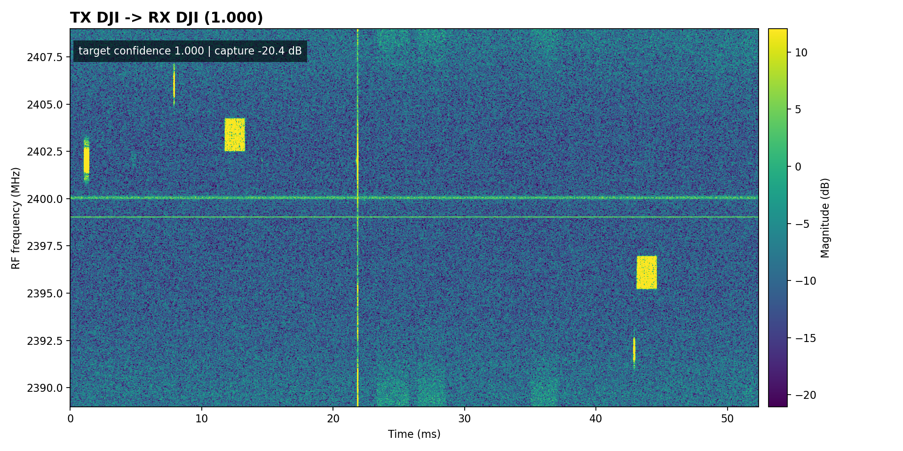
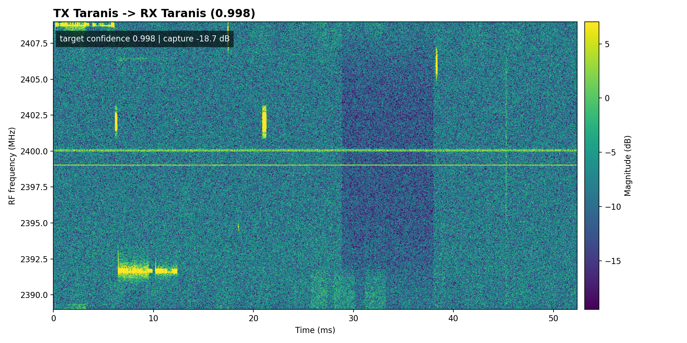

# RF Signal Intelligence


**Maintainer:** Jacob M. Ramey  
LinkedIn: https://www.linkedin.com/in/rameyjm/

Built a real-time RF drone-classification pipeline using live SDR-to-SDR IQ replay/receive, spectrogram-based VGG inference, ONNX export, TensorRT FP16 deployment on NVIDIA Jetson, and Nsight/trtexec profiling; achieved 68/70 exact OTA class matches across seven NoisyDroneRFv2 classes.

This repo covers the full practical path:

```text
public RF datasets -> reusable training/evaluation code -> live SDR replay/receive -> ONNX export -> Jetson TensorRT deployment
```

## Table of Contents

- [Overview](#overview)
- [Live OTA Noisy Drone Demo](#live-ota-noisy-drone-demo)
- [Headline Results](#headline-results)
- [Quickstart](#quickstart)
- [Repository Layout](#repository-layout)
- [Datasets And Cards](#datasets-and-cards)
- [CLI Workflows](#cli-workflows)
- [Live RF Classifier](#live-rf-classifier)
- [Jetson TensorRT Deployment](#jetson-tensorrt-deployment)
- [Testing](#testing)
- [Docker](#docker)
- [Notes](#notes)
- [Licensing](#licensing)
- [Citation](#citation)

## Overview

Implemented workflows include:

- NoisyDroneRFv2 VGG full-complex spectrogram classification
- Live over-the-air SDR replay/receive classification using SoapySDR, bladeRF TX, and HackRF RX
- RML2016, RML2018, and DeepRadar2022 training/evaluation experiments
- Reusable Python workflows under `src/rf_signal_intelligence/`
- Config-driven CLI entrypoints for training, evaluation, comparison, and ONNX export
- Jetson TensorRT FP16 benchmarking and profiling support

The former notebooks have been converted into versioned Python pipelines under `pipelines/`, while maintained reusable workflow logic lives in package code and CLI entrypoints.

## Live OTA Noisy Drone Demo

The strongest current demo replays labeled NoisyDroneRFv2 IQ samples from one SDR and classifies the received live RF capture from another SDR.

```text
NoisyDroneRFv2 IQ sample -> SDR TX replay -> live RF capture -> waterfall window selection -> VGG spectrogram model -> class/confidence
```

This validates the classifier through an actual RF transmit/receive hardware path rather than only offline dataset inference.

| Test | Result |
|---|---:|
| Classes | 7 |
| Trials | 70 |
| Exact final prediction matches | 68/70 |
| OTA sweep accuracy | 0.971 |
| Frequency | 2.399 GHz |
| Sample rate | 20 MS/s |
| Bandwidth | 20 MHz |

Hardware setup:

| Component | Used for |
|---|---|
| bladeRF | TX replay |
| HackRF | RX capture |
| Center frequency | 2.399 GHz |
| Sample rate | 20 MS/s |
| Bandwidth | 20 MHz |
| Dataset | NoisyDroneRFv2 |
| Model | VGG full-complex spectrogram |

Representative live RX waterfall/classification overlays:

| DJI live OTA classification | Taranis live OTA classification |
|---|---|
|  |  |

Full evidence:

- [70-trial OTA SDR-to-SDR sweep report](results/noisy_drone_rf_v2/snr20_class_sweep_results.md)
- [NoisyDroneRFv2 result card](docs/results/noisy_drone_rf_v2/README.md)
- [Jetson TensorRT benchmark/profile summary](results/benchmarks/noisy_drone_tensorrt_jetson.md)

## Headline Results

| Area | Model / protocol | Result |
|---|---|---:|
| Live OTA NoisyDroneRFv2 | SDR TX/RX, SNR >= 20 dB class sweep | 68/70 exact matches |
| NoisyDroneRFv2 offline | VGG full-complex spectrogram, natural held-out test | 0.9769 accuracy |
| NoisyDroneRFv2 offline | VGG full-complex spectrogram, balanced held-out test | 0.9803 accuracy |
| Jetson TensorRT | FP16 engine benchmark | 79.0 ms mean latency |
| Jetson TensorRT | Direct per-class validation | 7/7 classes matched |
| RML2016 | CNN-transformer, all SNR levels | 0.6645 accuracy |
| RML2016 | CNN-transformer, SNR > -2 dB | 0.8969 accuracy |
| RML2018 | LSTM continued checkpoint, documented evaluation protocol | 0.8295 accuracy |

Detailed offline result history, older plots, and protocol notes live in [docs/results/offline_model_results.md](docs/results/offline_model_results.md). Dataset/model caveats are documented in the cards under `docs/`.

## Quickstart

```bash
python3 -m venv .venv
source .venv/bin/activate
python -m pip install --upgrade pip
pip install -e ".[dev,test]"
```

For NoisyDroneRFv2 `.pt` files:

```bash
pip install -e ".[noisy-drone]"
```

For GPU-focused environments:

```bash
pip install -e ".[gpu]"
```

## Repository Layout

```text
src/rf_signal_intelligence/       Reusable Python package
  core/                           Maintained runtime/training components
  data/                           Dataset manifests and IQ loading helpers
  features/                       RF feature extraction
  workflows/                      Config-driven train/evaluate/export workflows
  models/                         Maintained model definitions
configs/                          Dataset and model workflow configs
exports/                          ONNX validation and inference helpers
deploy/                           Jetson/TensorRT scripts
models/                           Saved model artifacts
outputs/                          Generated local outputs
results/                          Curated result reports and figures
pipelines/                        Reproducible Python pipeline frontends
docs/                             Model cards, dataset cards, reports, protocols
tests/                            Unit and integration tests
```

Archived experiments and prototype notebooks are preserved on the `archive/legacy-notebooks` branch.

## Datasets And Cards

Dataset cards:

- [Noisy Drone RF v2](docs/dataset_cards/noisy_drone_rf_v2.md)
- [RML2016.10A](docs/dataset_cards/rml2016.md)
- [RML2018.01A](docs/dataset_cards/rml2018.md)
- [DeepRadar2022](docs/dataset_cards/deepradar2022.md)

Model cards:

- [NoisyDroneRFv2 VGG](docs/model_cards/noisy_drone_rf_v2_vgg.md)
- [RML2016 CNN-transformer](docs/model_cards/rml2016_cnn_transformer.md)
- [RML2018 LSTM](docs/model_cards/rml2018_lstm.md)
- [DeepRadar2022 CNN-transformer](docs/model_cards/deepradar2022_cnn_transformer.md)

Evaluation and deployment references:

- [Evaluation protocols](docs/evaluation_protocols.md)
- [Detailed offline results](docs/results/offline_model_results.md)
- [Jetson TensorRT deployment guide](docs/jetson_tensorrt_deployment.md)

## CLI Workflows

The preferred workflow is the `rfsi` CLI plus pipeline scripts that call reusable code under `src/`.

```bash
# Train or continue the canonical NoisyDroneRFv2 VGG spectrogram model.
rfsi train --config configs/noisy_drone_vgg.yaml

# Evaluate the canonical NoisyDroneRFv2 VGG spectrogram model.
rfsi evaluate \
  --config configs/noisy_drone_vgg.yaml \
  --checkpoint models/noisy_drone_rf_v2/noisy_drone_rf_v2_vgg_full_complex_spectrogram_best.keras

# Rebuild cross-dataset comparison artifacts.
rfsi compare --config configs/evaluation_comparison.yaml

# Export the NoisyDroneRFv2 model and supporting ONNX artifacts.
rfsi export-onnx \
  --config configs/noisy_drone_vgg.yaml \
  --out models/noisy_drone_rf_v2/noisy_drone_rf_v2_vgg_full_complex_spectrogram.onnx \
  --sample-out models/noisy_drone_rf_v2/sample_input.npy \
  --labels-out models/noisy_drone_rf_v2/labels.json
```

Run the exported ONNX model locally on CPU:

```bash
models/noisy_drone_rf_v2/run_onnx_inference.sh --providers CPUExecutionProvider
```

Run one high-SNR dataset sample per class:

```bash
models/noisy_drone_rf_v2/run_onnx_inference.sh \
  --class-sweep \
  --dataset-dir /data/rameyjm7/datasets/NoisyDroneRFv2 \
  --min-snr 20 \
  --samples-per-class 1 \
  --format table \
  --providers CPUExecutionProvider
```

Legacy RML2016 entrypoint:

```bash
rf-signal-intelligence --mode evaluate_only
```

## Live RF Classifier

Run the NoisyDroneRFv2 model against IQ playback, live SDR receive, or SDR-to-SDR over-the-air replay.

```text
IQ source -> windowing -> preprocessing/spectrogram -> model inference -> class/confidence -> latency/throughput reporting
```

IQ file playback:

```bash
python scripts/live_noisy_drone_rf_classifier.py \
  --iq-file outputs/rx_debug.npy \
  --model models/noisy_drone_rf_v2/noisy_drone_rf_v2_vgg_full_complex_spectrogram_best.keras \
  --window-samples 1048576 \
  --nfft 1024 \
  --hop 1024 \
  --time-bins 1024 \
  --once
```

Live SDR receive with SoapySDR:

```bash
python scripts/live_noisy_drone_rf_classifier.py \
  --device-args driver=hackrf \
  --freq 2.399e9 \
  --sample-rate 20e6 \
  --bandwidth 20e6 \
  --gain 60 \
  --model models/noisy_drone_rf_v2/noisy_drone_rf_v2_vgg_full_complex_spectrogram_best.keras
```

SDR-to-SDR replay and receive demo:

```bash
python scripts/live_noisy_drone_rf_classifier.py \
  --tx \
  --tx-dataset-dir /data/rameyjm7/datasets/NoisyDroneRFv2 \
  --tx-class-name DJI \
  --tx-min-snr 24 \
  --device-args driver=hackrf \
  --tx-device-args driver=bladerf \
  --freq 2.399e9 \
  --sample-rate 20e6 \
  --bandwidth 20e6 \
  --tx-bandwidth 20e6 \
  --gain 60 \
  --tx-gain 60 \
  --once \
  --save-rx-iq outputs/rx_debug.npy
```

Reproduce the documented OTA class sweep:

```bash
python scripts/live_noisy_drone_rf_classifier.py \
  --tx-test-all-classes \
  --tx-test-classes DJI,FutabaT14,FutabaT7,Graupner,Noise,Taranis,Turnigy \
  --tx-test-count 10 \
  --tx-min-snr 20 \
  --tx-test-output-csv outputs/noisy_drone_rf_v2_snr20_class_sweep.csv \
  --tx-test-output-md results/noisy_drone_rf_v2/snr20_class_sweep_results.md \
  --tx-test-save-rx-dir outputs/noisy_drone_rf_v2_snr20_iq \
  --tx-test-save-plots-dir results/noisy_drone_rf_v2/snr20_waterfalls
```

## Jetson TensorRT Deployment

The NoisyDroneRFv2 model has a documented edge-inference path:

```text
Keras model -> ONNX export -> TensorRT FP16 engine -> Jetson inference -> trtexec benchmark -> Nsight Systems profile
```

| Check | Result |
|---|---:|
| TensorRT `trtexec` mean latency | 79.0 ms |
| TensorRT `trtexec` throughput | 12.58 qps |
| Direct TensorRT class validation | 7/7 classes matched |
| Nsight Systems profile | Captured and summarized |

Runtime comparison:

| Runtime | Platform | Precision | Mean latency |
|---|---|---|---:|
| TensorRT | Jetson | FP16 | 79.0 ms |

Planned baselines: Keras/TensorFlow FP32 and ONNX Runtime CPU/CUDA.

See:

- [Jetson TensorRT deployment guide](docs/jetson_tensorrt_deployment.md)
- [Jetson TensorRT benchmark/profile summary](results/benchmarks/noisy_drone_tensorrt_jetson.md)

## Testing

Fast checks:

```bash
ruff check src tests
pytest -q -m "not integration"
```

Full local check:

```bash
ruff check src tests && pytest -q -m "not integration" && pytest -q -m integration -rs
```

Registry-driven smoke evaluation:

```bash
python scripts/smoke_eval_registry.py
python scripts/smoke_eval_registry.py --with-data --require-artifacts
```

## Docker

From `docker/`:

```bash
make build
make run
```

See [docker/README.md](docker/README.md) for Docker Hub and Apptainer/HPC usage.

## Notes

- Large datasets and model artifacts are expected; this repository is data-heavy.
- Public dataset results are not equivalent to live field collection.
- Release/tag process is documented in `RELEASE.md`.

## Licensing

RF Signal Intelligence is source-available for personal, educational, research,
evaluation, and other non-commercial use. All commercial rights are retained by
Jacob Ramey and RTG LLC. Commercial use, paid deployment, commercial hosting,
integration into commercial products or services, contract deliverables, managed
service offerings, or other revenue-generating use requires prior written
permission.

This repository uses and references third-party datasets, models, SDR drivers,
tools, and protocol materials. Jacob Ramey and RTG LLC make no ownership claim
over those third-party materials, including NoisyDroneRF, RFUAV, DeepSig
RadioML, RML2016, RML2018, DeepRadar2022, or any other external dataset. Those
materials remain subject to their original licenses, terms, and redistribution
restrictions.

For commercial licensing, integration, support, or permission inquiries, contact:

- Jacob Ramey: rameyjm7@gmail.com
- RTG LLC: jake.rtgllc@gmail.com

## Citation

Jacob M. Ramey. RF Signal Intelligence: Real-Time RF Drone Classification with SDR, ONNX, TensorRT, and Jetson Deployment. 2025.
