# Live OTA Noisy Drone RF Classification Results

Generated: `2026-07-04T14:49:53+00:00`

This test replays labeled NoisyDroneRF IQ samples over the air from one SDR and classifies the received live RF capture from another SDR. The result below is an end-to-end TX/RX hardware classification check, not just offline inference on dataset files.

## Summary

- Trials: `18`
- Exact final prediction matches: `18/18`
- Accuracy: `1.000`
- Classes: `DJI, FutabaT14, FutabaT7, Graupner, Taranis, Turnigy`
- CSV: `../../outputs/class_sweep.csv`
- RX IQ windows: `../../outputs/class_sweep_iq`
- Waterfall snapshots: `waterfalls/`

## Next Validation Matrix

The current result is a controlled hardware-in-the-loop baseline: 18 live OTA replay trials, three per transmitter class, using high-SNR dataset samples and excluding the Noise class. To strengthen the feasibility evidence without collecting live drone emissions, the next validation pass should expand this into a small controlled stress matrix.

Recommended additions:

- Increase to `10` trials per class.
- Include the `Noise` class.
- Repeat the class sweep at dataset SNR floors of `20`, `10`, and `0` dB.
- Repeat one lower-power RF setting to test link-margin sensitivity.

This would produce four OTA sweep reports:

| Run | Purpose | Trials | Key settings |
|---|---|---:|---|
| Baseline high-SNR replay | Repeat current condition with more trials and Noise included | 70 | `--tx-test-count 10 --tx-min-snr 20` |
| Medium-SNR replay | Check degradation against less ideal dataset samples | 70 | `--tx-test-count 10 --tx-min-snr 10` |
| Low-SNR replay | Stress the model with lower-SNR replay samples | 70 | `--tx-test-count 10 --tx-min-snr 0` |
| Lower-power RF link | Check sensitivity to reduced received signal strength | 70 | `--tx-test-count 10 --tx-min-snr 20 --tx-amplitude 0.10 --rx-gain 55` |

Suggested commands:

```bash
/home/jake/workspace/SDR/RF_Sentinel/.venv/bin/python3 scripts/live_noisy_drone_rf_classifier.py \
  --tx-test-all-classes \
  --tx-test-classes DJI,FutabaT14,FutabaT7,Graupner,Noise,Taranis,Turnigy \
  --tx-test-count 10 \
  --tx-min-snr 20 \
  --tx-test-output-csv outputs/noisy_drone_rf_v2_snr20_class_sweep.csv \
  --tx-test-output-md results/noisy_drone_rf_v2/snr20_class_sweep_results.md \
  --tx-test-save-rx-dir outputs/noisy_drone_rf_v2_snr20_iq \
  --tx-test-save-plots-dir results/noisy_drone_rf_v2/snr20_waterfalls

/home/jake/workspace/SDR/RF_Sentinel/.venv/bin/python3 scripts/live_noisy_drone_rf_classifier.py \
  --tx-test-all-classes \
  --tx-test-classes DJI,FutabaT14,FutabaT7,Graupner,Noise,Taranis,Turnigy \
  --tx-test-count 10 \
  --tx-min-snr 10 \
  --tx-test-output-csv outputs/noisy_drone_rf_v2_snr10_class_sweep.csv \
  --tx-test-output-md results/noisy_drone_rf_v2/snr10_class_sweep_results.md \
  --tx-test-save-rx-dir outputs/noisy_drone_rf_v2_snr10_iq \
  --tx-test-save-plots-dir results/noisy_drone_rf_v2/snr10_waterfalls

/home/jake/workspace/SDR/RF_Sentinel/.venv/bin/python3 scripts/live_noisy_drone_rf_classifier.py \
  --tx-test-all-classes \
  --tx-test-classes DJI,FutabaT14,FutabaT7,Graupner,Noise,Taranis,Turnigy \
  --tx-test-count 10 \
  --tx-min-snr 0 \
  --tx-test-output-csv outputs/noisy_drone_rf_v2_snr0_class_sweep.csv \
  --tx-test-output-md results/noisy_drone_rf_v2/snr0_class_sweep_results.md \
  --tx-test-save-rx-dir outputs/noisy_drone_rf_v2_snr0_iq \
  --tx-test-save-plots-dir results/noisy_drone_rf_v2/snr0_waterfalls

/home/jake/workspace/SDR/RF_Sentinel/.venv/bin/python3 scripts/live_noisy_drone_rf_classifier.py \
  --tx-test-all-classes \
  --tx-test-classes DJI,FutabaT14,FutabaT7,Graupner,Noise,Taranis,Turnigy \
  --tx-test-count 10 \
  --tx-min-snr 20 \
  --tx-amplitude 0.10 \
  --rx-gain 55 \
  --tx-test-output-csv outputs/noisy_drone_rf_v2_low_power_class_sweep.csv \
  --tx-test-output-md results/noisy_drone_rf_v2/low_power_class_sweep_results.md \
  --tx-test-save-rx-dir outputs/noisy_drone_rf_v2_low_power_iq \
  --tx-test-save-plots-dir results/noisy_drone_rf_v2/low_power_waterfalls
```

The current baseline result should be interpreted as a successful initial OTA replay validation. The matrix above would strengthen it into a repeatable controlled SDR benchmark with basic variation across class, Noise rejection, dataset SNR, and RF link margin.

## OTA SDR Setup

| Setting | Value |
|---|---:|
| Model | `models/noisy_drone_rf_v2/noisy_drone_rf_v2_vgg_full_complex_spectrogram_best.keras` |
| TX SDR | `driver=bladerf,serial=7faa712b1fab42f4b84e494171b91721` |
| TX frontend | `bladeRF TX1` |
| TX antenna | `TX` |
| RX SDR | `driver=hackrf` |
| RX frontend | `RX channel 0` |
| RX antenna | `` |
| Frequency | `2399000000 Hz` |
| Sample rate | `20000000 S/s` |
| Bandwidth | `20000000 Hz` |
| RX gain | `60.0` |
| TX gain | `60.0` |
| TX amplitude | `0.2` |
| TX min SNR | `20` |
| Window samples | `1048576` |
| Capture samples | `4194304` |
| Window score mode | `auto` |
| Decision mode | `hybrid` |
| Non-noise threshold | `0.55` |

## Confusion Matrix

Rows are transmitted dataset labels. Columns are final live OTA predictions.

| TX \ RX | DJI | FutabaT14 | FutabaT7 | Graupner | Taranis | Turnigy |
|---|---:|---:|---:|---:|---:|---:|
| DJI | 3 | 0 | 0 | 0 | 0 | 0 |
| FutabaT14 | 0 | 3 | 0 | 0 | 0 | 0 |
| FutabaT7 | 0 | 0 | 3 | 0 | 0 | 0 |
| Graupner | 0 | 0 | 0 | 3 | 0 | 0 |
| Taranis | 0 | 0 | 0 | 0 | 3 | 0 |
| Turnigy | 0 | 0 | 0 | 0 | 0 | 3 |

## Waterfall Snapshots

Each image is rendered from the selected live RX IQ window used for classification. The overlay shows the transmitted class, final prediction, confidence, and capture power.

### Trial 1: DJI -> DJI

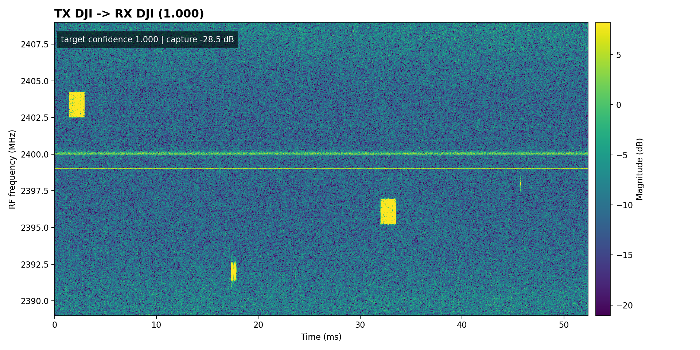

### Trial 2: DJI -> DJI

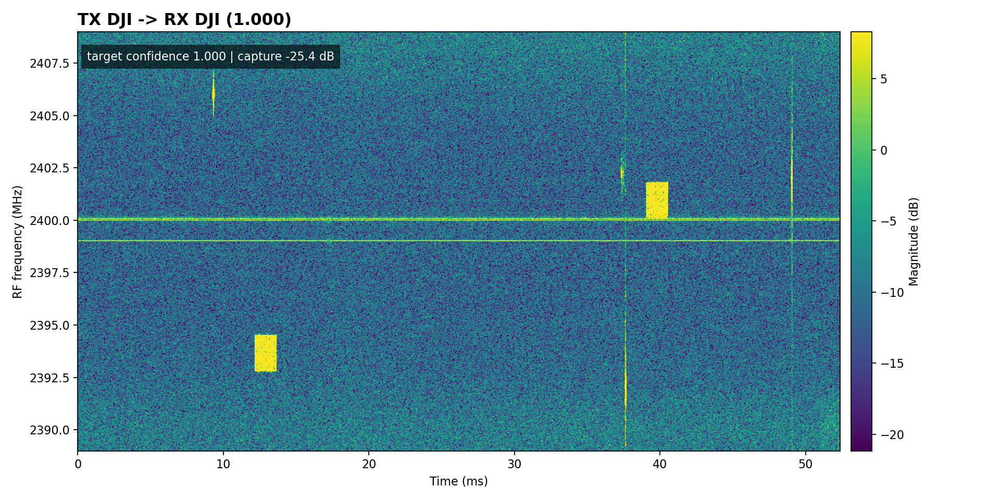

### Trial 3: DJI -> DJI

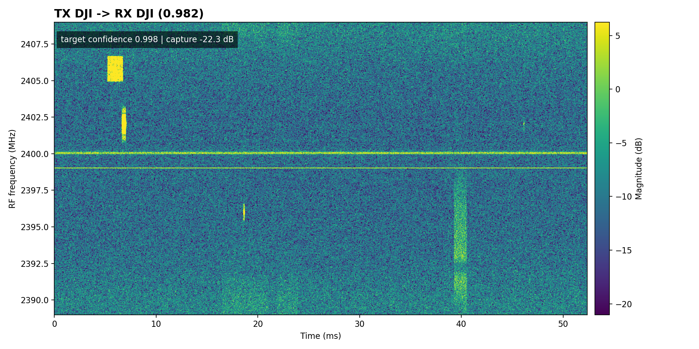

### Trial 4: FutabaT14 -> FutabaT14

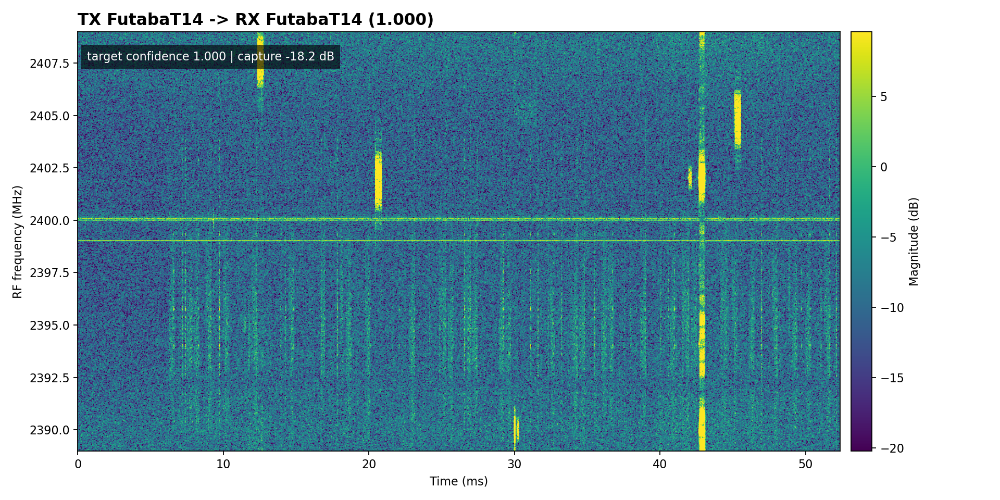

### Trial 5: FutabaT14 -> FutabaT14

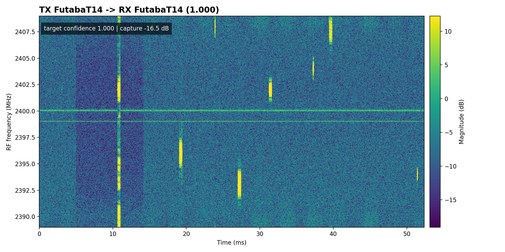

### Trial 6: FutabaT14 -> FutabaT14

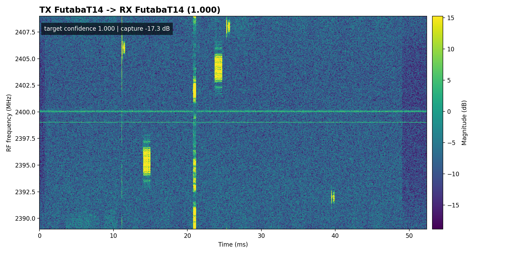

### Trial 7: FutabaT7 -> FutabaT7

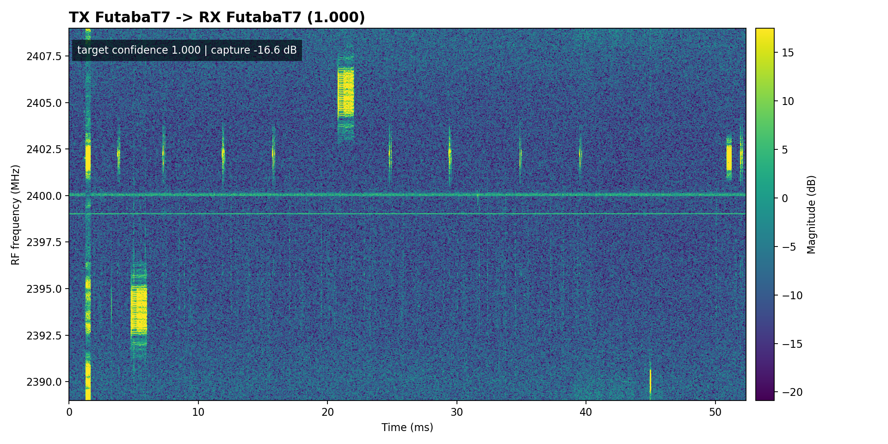

### Trial 8: FutabaT7 -> FutabaT7

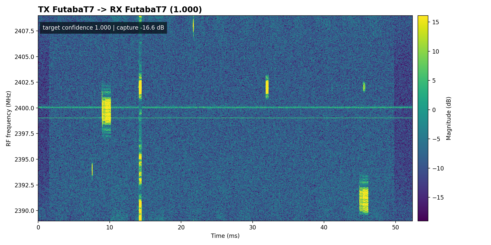

### Trial 9: FutabaT7 -> FutabaT7

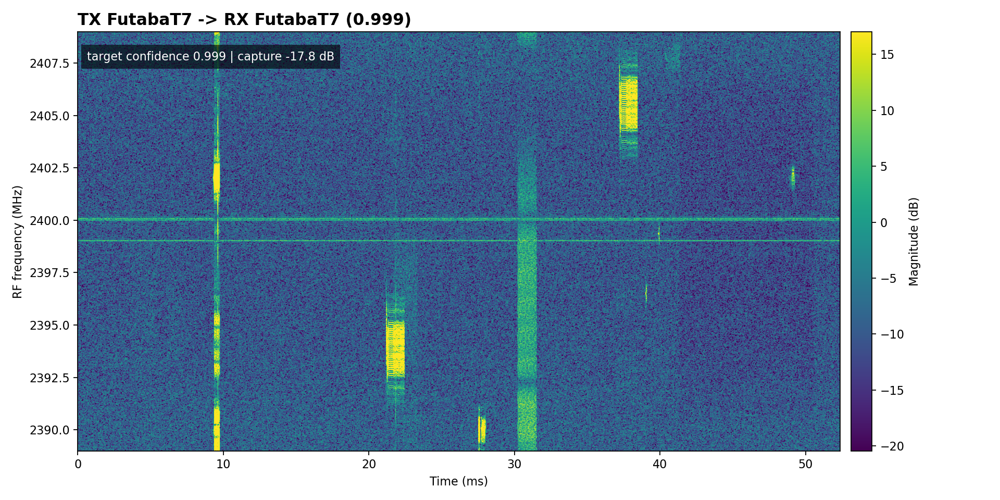

### Trial 10: Graupner -> Graupner

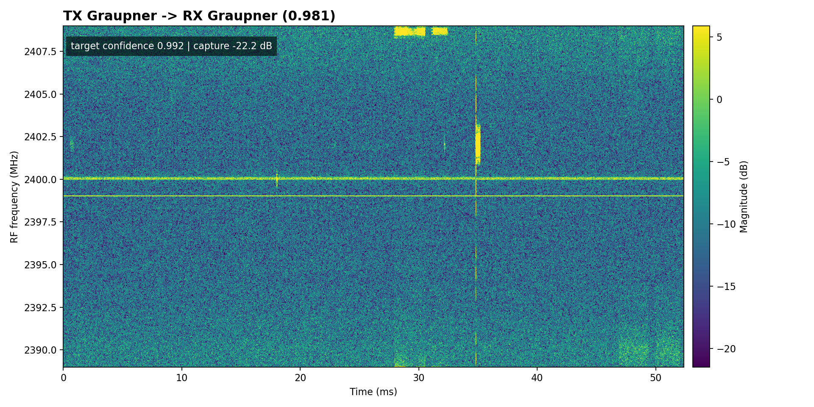

### Trial 11: Graupner -> Graupner

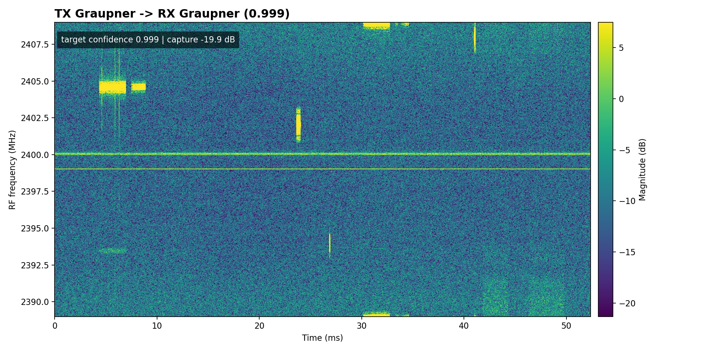

### Trial 12: Graupner -> Graupner

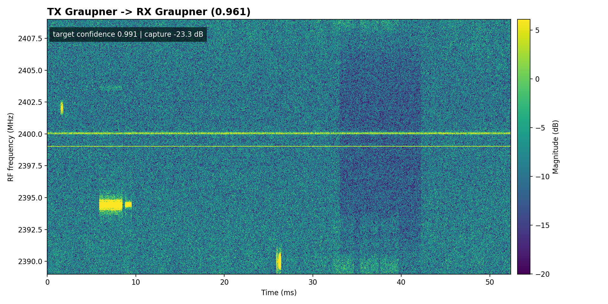

### Trial 13: Taranis -> Taranis

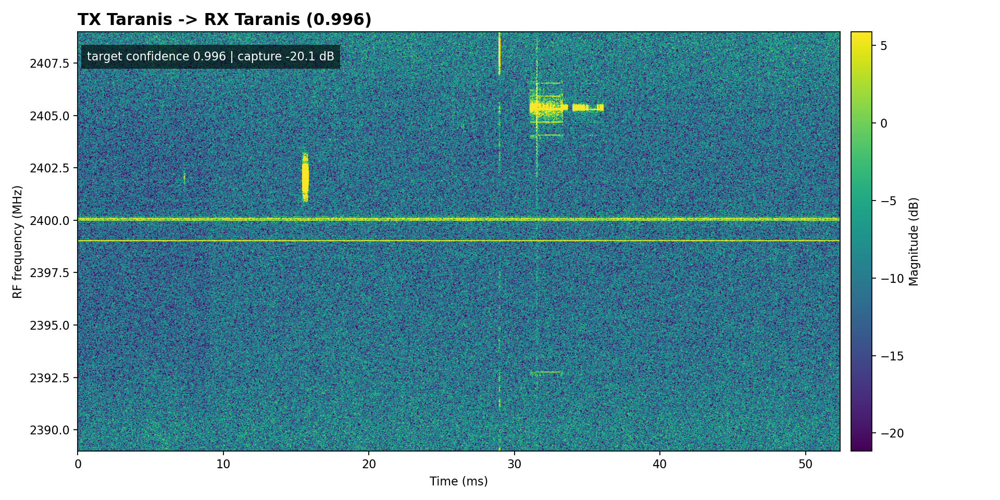

### Trial 14: Taranis -> Taranis

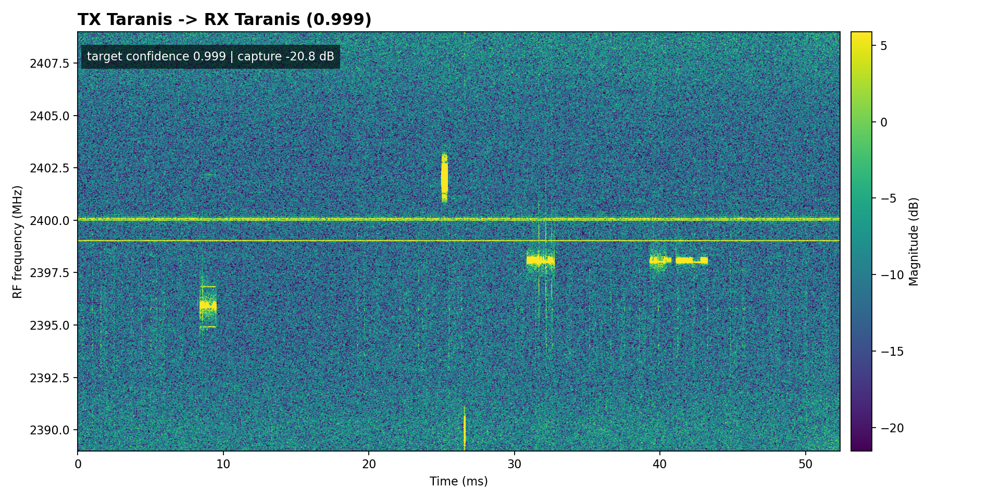

### Trial 15: Taranis -> Taranis

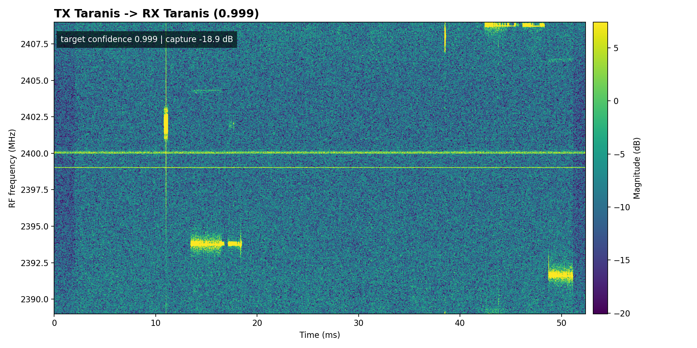

### Trial 16: Turnigy -> Turnigy

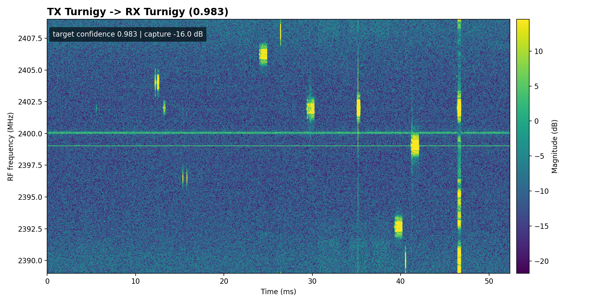

### Trial 17: Turnigy -> Turnigy

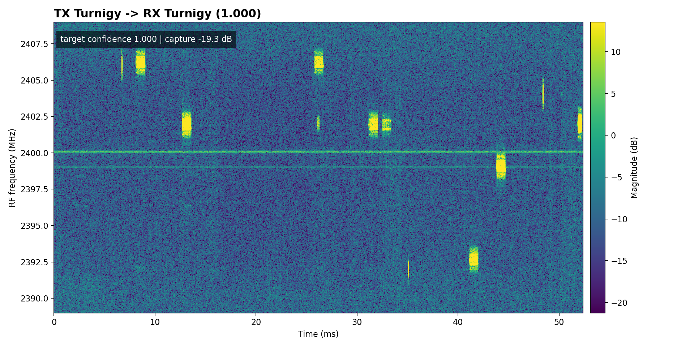

### Trial 18: Turnigy -> Turnigy

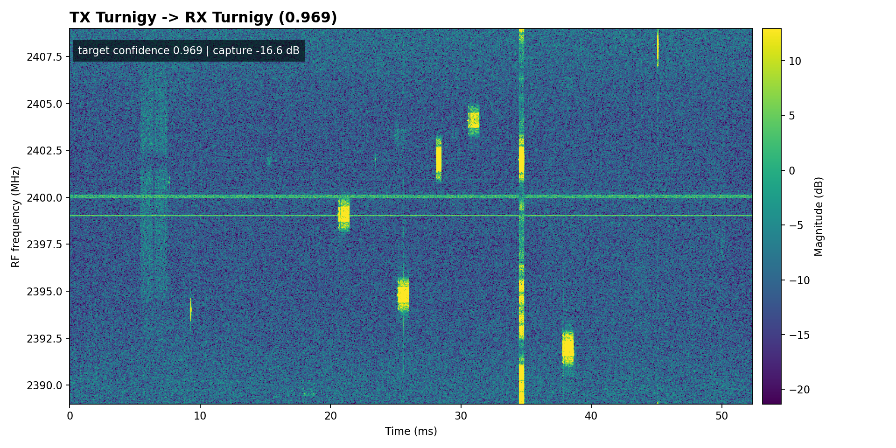


## Command

```bash
/home/jake/workspace/SDR/RF_Sentinel/.venv/bin/python3 /home/jake/workspace/SDR/rf-signal-intelligence/scripts/live_noisy_drone_rf_classifier.py --tx-test-all-classes --tx-test-classes DJI,FutabaT14,FutabaT7,Graupner,Taranis,Turnigy --tx-test-count 3
```

## Per-Class Summary

| Class | Pass/Total | Accuracy | Min Target Confidence | Mean Target Confidence | Mean Capture Power dB | Max Full-Scale % |
|---|---:|---:|---:|---:|---:|---:|
| DJI | 3/3 | 1.000 | 0.998 | 0.999 | -25.4 | 0.000 |
| FutabaT14 | 3/3 | 1.000 | 1.000 | 1.000 | -17.3 | 0.830 |
| FutabaT7 | 3/3 | 1.000 | 0.999 | 1.000 | -17.0 | 0.910 |
| Graupner | 3/3 | 1.000 | 0.991 | 0.994 | -21.8 | 0.130 |
| Taranis | 3/3 | 1.000 | 0.996 | 0.998 | -19.9 | 0.170 |
| Turnigy | 3/3 | 1.000 | 0.969 | 0.984 | -17.3 | 0.910 |

## Per-Trial Results

| Trial | Target | Prediction | Confidence | Best Non-Noise | Target Confidence | Capture Power dB | Full-Scale % | TX Sample | RX IQ | Waterfall |
|---:|---|---|---:|---|---:|---:|---:|---|---|---|
| 1 | DJI | DJI | 1.000 | DJI | 1.000 | -28.5 | 0.00 | IQdata_sample709_target0_snr30.pt true=DJI target=0 snr=30dB | `../../outputs/class_sweep_iq/001_DJI.npy` | `waterfalls/001_DJI_waterfall.png` |
| 2 | DJI | DJI | 1.000 | DJI | 1.000 | -25.4 | 0.00 | IQdata_sample1122_target0_snr30.pt true=DJI target=0 snr=30dB | `../../outputs/class_sweep_iq/002_DJI.npy` | `waterfalls/002_DJI_waterfall.png` |
| 3 | DJI | DJI | 0.982 | DJI | 0.998 | -22.3 | 0.00 | IQdata_sample868_target0_snr24.pt true=DJI target=0 snr=24dB | `../../outputs/class_sweep_iq/003_DJI.npy` | `waterfalls/003_DJI_waterfall.png` |
| 4 | FutabaT14 | FutabaT14 | 1.000 | FutabaT14 | 1.000 | -18.2 | 0.75 | IQdata_sample3367_target1_snr22.pt true=FutabaT14 target=1 snr=22dB | `../../outputs/class_sweep_iq/004_FutabaT14.npy` | `waterfalls/004_FutabaT14_waterfall.png` |
| 5 | FutabaT14 | FutabaT14 | 1.000 | FutabaT14 | 1.000 | -16.5 | 0.83 | IQdata_sample3944_target1_snr20.pt true=FutabaT14 target=1 snr=20dB | `../../outputs/class_sweep_iq/005_FutabaT14.npy` | `waterfalls/005_FutabaT14_waterfall.png` |
| 6 | FutabaT14 | FutabaT14 | 1.000 | FutabaT14 | 1.000 | -17.3 | 0.82 | IQdata_sample4618_target1_snr20.pt true=FutabaT14 target=1 snr=20dB | `../../outputs/class_sweep_iq/006_FutabaT14.npy` | `waterfalls/006_FutabaT14_waterfall.png` |
| 7 | FutabaT7 | FutabaT7 | 1.000 | FutabaT7 | 1.000 | -16.6 | 0.75 | IQdata_sample5426_target2_snr20.pt true=FutabaT7 target=2 snr=20dB | `../../outputs/class_sweep_iq/007_FutabaT7.npy` | `waterfalls/007_FutabaT7_waterfall.png` |
| 8 | FutabaT7 | FutabaT7 | 1.000 | FutabaT7 | 1.000 | -16.6 | 0.91 | IQdata_sample5085_target2_snr20.pt true=FutabaT7 target=2 snr=20dB | `../../outputs/class_sweep_iq/008_FutabaT7.npy` | `waterfalls/008_FutabaT7_waterfall.png` |
| 9 | FutabaT7 | FutabaT7 | 0.999 | FutabaT7 | 0.999 | -17.8 | 0.75 | IQdata_sample4963_target2_snr22.pt true=FutabaT7 target=2 snr=22dB | `../../outputs/class_sweep_iq/009_FutabaT7.npy` | `waterfalls/009_FutabaT7_waterfall.png` |
| 10 | Graupner | Graupner | 0.981 | Graupner | 0.992 | -22.2 | 0.00 | IQdata_sample6065_target3_snr30.pt true=Graupner target=3 snr=30dB | `../../outputs/class_sweep_iq/010_Graupner.npy` | `waterfalls/010_Graupner_waterfall.png` |
| 11 | Graupner | Graupner | 0.999 | Graupner | 0.999 | -19.9 | 0.13 | IQdata_sample6086_target3_snr30.pt true=Graupner target=3 snr=30dB | `../../outputs/class_sweep_iq/011_Graupner.npy` | `waterfalls/011_Graupner_waterfall.png` |
| 12 | Graupner | Graupner | 0.961 | Graupner | 0.991 | -23.3 | 0.00 | IQdata_sample6308_target3_snr22.pt true=Graupner target=3 snr=22dB | `../../outputs/class_sweep_iq/012_Graupner.npy` | `waterfalls/012_Graupner_waterfall.png` |
| 13 | Taranis | Taranis | 0.996 | Taranis | 0.996 | -20.1 | 0.17 | IQdata_sample6929_target5_snr28.pt true=Taranis target=5 snr=28dB | `../../outputs/class_sweep_iq/013_Taranis.npy` | `waterfalls/013_Taranis_waterfall.png` |
| 14 | Taranis | Taranis | 0.999 | Taranis | 0.999 | -20.8 | 0.00 | IQdata_sample7626_target5_snr20.pt true=Taranis target=5 snr=20dB | `../../outputs/class_sweep_iq/014_Taranis.npy` | `waterfalls/014_Taranis_waterfall.png` |
| 15 | Taranis | Taranis | 0.999 | Taranis | 0.999 | -18.9 | 0.17 | IQdata_sample7763_target5_snr22.pt true=Taranis target=5 snr=22dB | `../../outputs/class_sweep_iq/015_Taranis.npy` | `waterfalls/015_Taranis_waterfall.png` |
| 16 | Turnigy | Turnigy | 0.983 | Turnigy | 0.983 | -16.0 | 0.90 | IQdata_sample8189_target6_snr30.pt true=Turnigy target=6 snr=30dB | `../../outputs/class_sweep_iq/016_Turnigy.npy` | `waterfalls/016_Turnigy_waterfall.png` |
| 17 | Turnigy | Turnigy | 1.000 | Turnigy | 1.000 | -19.3 | 0.02 | IQdata_sample8390_target6_snr26.pt true=Turnigy target=6 snr=26dB | `../../outputs/class_sweep_iq/017_Turnigy.npy` | `waterfalls/017_Turnigy_waterfall.png` |
| 18 | Turnigy | Turnigy | 0.969 | Turnigy | 0.969 | -16.6 | 0.91 | IQdata_sample8860_target6_snr30.pt true=Turnigy target=6 snr=30dB | `../../outputs/class_sweep_iq/018_Turnigy.npy` | `waterfalls/018_Turnigy_waterfall.png` |

## Notes

- `prediction` is the final script decision after the configured decision policy.
- `best_non_noise` and `target confidence` are conditional on the non-noise class mass.
- Full-scale percentages above zero indicate some clipping or saturation in the saved RX window.
