# Live OTA Noisy Drone RF Classification Results

Generated: `2026-07-04T18:11:07+00:00`

This test replays labeled NoisyDroneRF IQ samples over the air from one SDR and classifies the received live RF capture from another SDR. The result below is an end-to-end TX/RX hardware classification check, not just offline inference on dataset files.

## Summary

- Trials: `70`
- Exact final prediction matches: `68/70`
- Accuracy: `0.971`
- Classes: `DJI, FutabaT14, FutabaT7, Graupner, Noise, Taranis, Turnigy`
- CSV: `outputs/noisy_drone_rf_v2_snr20_class_sweep.csv`
- RX IQ windows: `outputs/noisy_drone_rf_v2_snr20_iq`
- Waterfall snapshots: `results/noisy_drone_rf_v2/snr20_waterfalls`

## OTA SDR Setup

| Setting | Value |
|---|---:|
| Model | `/home/jake/workspace/SDR/rf-signal-intelligence/models/noisy_drone_rf_v2/noisy_drone_rf_v2_vgg_full_complex_spectrogram_best.keras` |
| TX SDR | `driver=bladerf,serial=7faa712b1fab42f4b84e494171b91721` |
| TX frontend | `bladeRF TX1` |
| TX antenna | `TX` |
| RX SDR | `driver=hackrf` |
| RX frontend | `RX channel 0` |
| RX antenna | `` |
| Frequency | `2399000000 Hz` |
| Sample rate | `20000000 S/s` |
| Bandwidth | `20000000 Hz` |
| RX gain | `60.0` |
| TX gain | `60.0` |
| TX amplitude | `0.2` |
| TX min SNR | `20` |
| Window samples | `1048576` |
| Capture samples | `4194304` |
| Window score mode | `auto` |
| Decision mode | `hybrid` |
| Non-noise threshold | `0.55` |

## Confusion Matrix

Rows are transmitted dataset labels. Columns are final live OTA predictions.

| TX \ RX | DJI | FutabaT14 | FutabaT7 | Graupner | Noise | Taranis | Turnigy |
|---|---:|---:|---:|---:|---:|---:|---:|
| DJI | 10 | 0 | 0 | 0 | 0 | 0 | 0 |
| FutabaT14 | 0 | 10 | 0 | 0 | 0 | 0 | 0 |
| FutabaT7 | 0 | 0 | 10 | 0 | 0 | 0 | 0 |
| Graupner | 0 | 0 | 0 | 10 | 0 | 0 | 0 |
| Noise | 0 | 1 | 0 | 0 | 9 | 0 | 0 |
| Taranis | 0 | 0 | 0 | 0 | 1 | 9 | 0 |
| Turnigy | 0 | 0 | 0 | 0 | 0 | 0 | 10 |

## Waterfall Snapshots

Each image is rendered from the selected live RX IQ window used for classification. The overlay shows the transmitted class, final prediction, confidence, and capture power.

Representative snapshots are shown below: selected wins across the transmitter classes plus both misses from the 70-trial sweep. The full per-trial accounting remains in the table below.

### Trial 1: DJI -> DJI (WIN)

Confidence `1.000`, target confidence `1.000`, capture power `-20.4 dB`, full-scale `0.12%`.


### Trial 8: DJI -> DJI (WIN)

Confidence `0.996`, target confidence `0.998`, capture power `-26.8 dB`, full-scale `0.00%`.

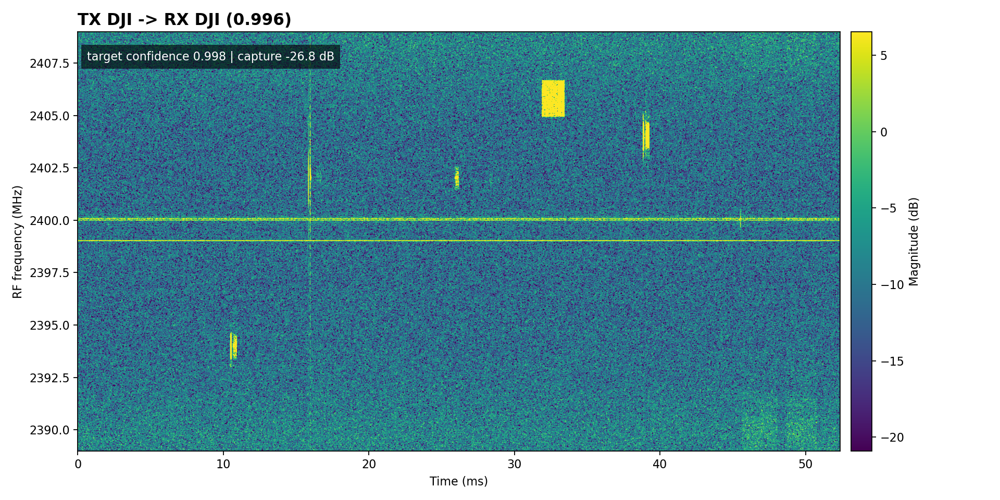

### Trial 11: FutabaT14 -> FutabaT14 (WIN)

Confidence `1.000`, target confidence `1.000`, capture power `-17.9 dB`, full-scale `0.75%`.

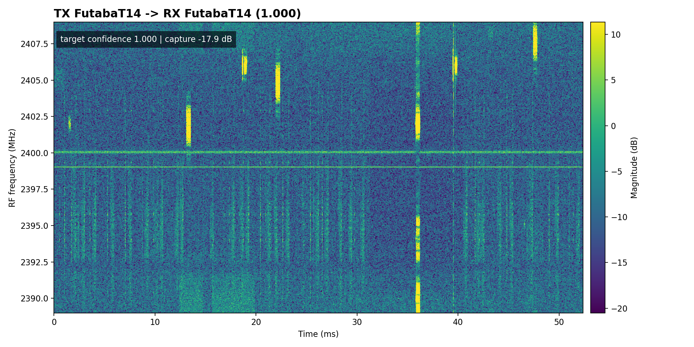

### Trial 20: FutabaT14 -> FutabaT14 (WIN)

Confidence `1.000`, target confidence `1.000`, capture power `-17.1 dB`, full-scale `0.75%`.

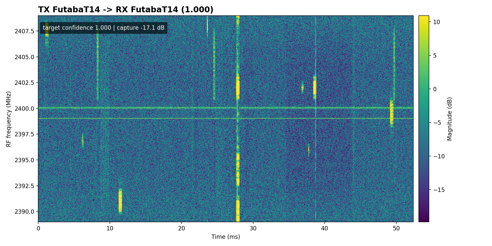

### Trial 21: FutabaT7 -> FutabaT7 (WIN)

Confidence `1.000`, target confidence `1.000`, capture power `-17.9 dB`, full-scale `0.75%`.

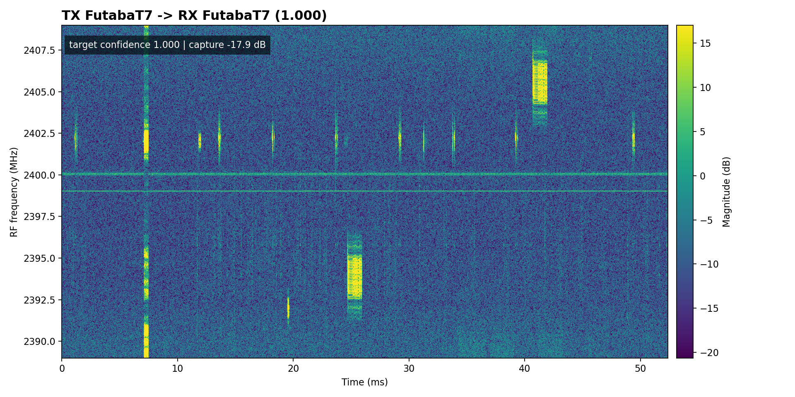

### Trial 24: FutabaT7 -> FutabaT7 (WIN)

Confidence `0.761`, target confidence `0.766`, capture power `-18.0 dB`, full-scale `0.75%`.

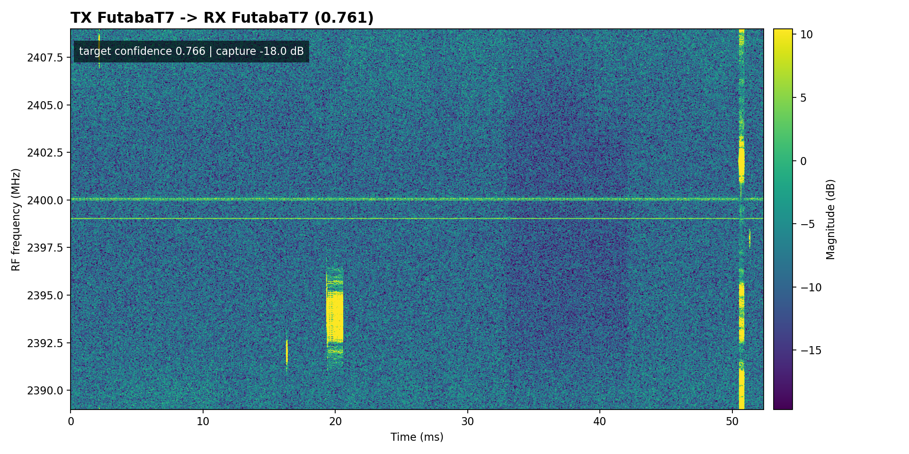

### Trial 29: FutabaT7 -> FutabaT7 (WIN)

Confidence `0.953`, target confidence `0.956`, capture power `-26.5 dB`, full-scale `0.00%`.

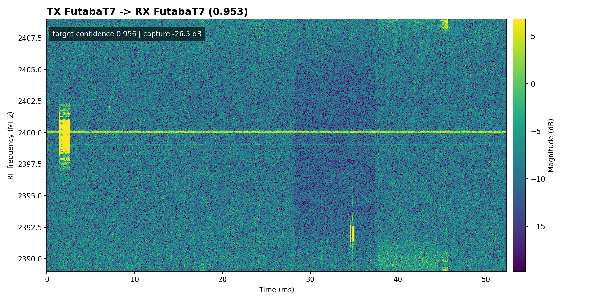

### Trial 31: Graupner -> Graupner (WIN)

Confidence `0.878`, target confidence `0.964`, capture power `-20.6 dB`, full-scale `0.00%`.

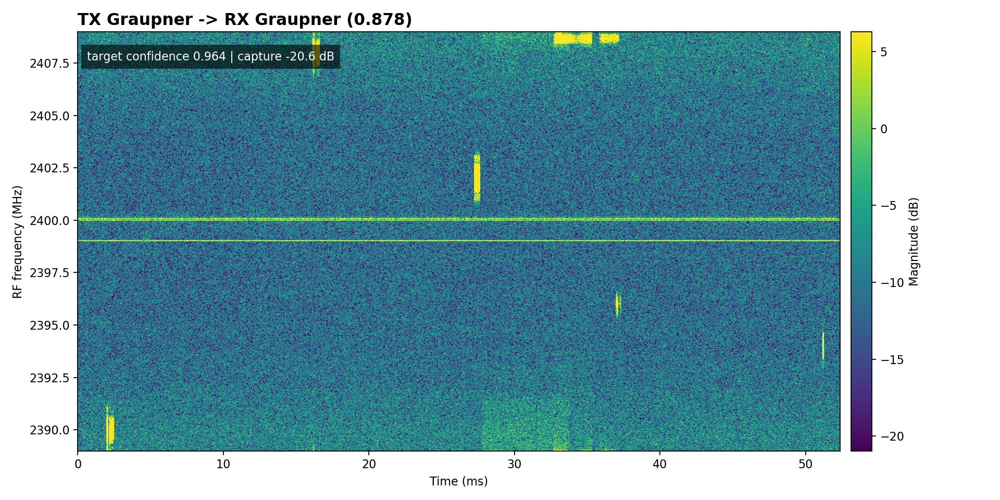

### Trial 40: Graupner -> Graupner (WIN)

Confidence `0.994`, target confidence `0.997`, capture power `-24.0 dB`, full-scale `0.01%`.

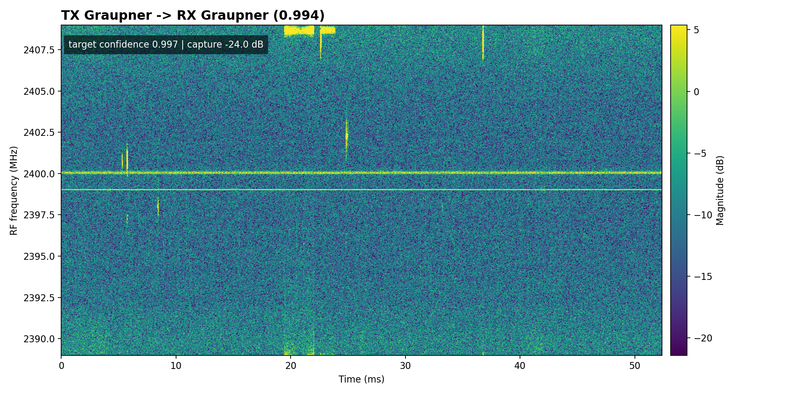

### Trial 41: Noise -> Noise (WIN)

Confidence `0.997`, target confidence `n/a`, capture power `-20.3 dB`, full-scale `0.01%`.

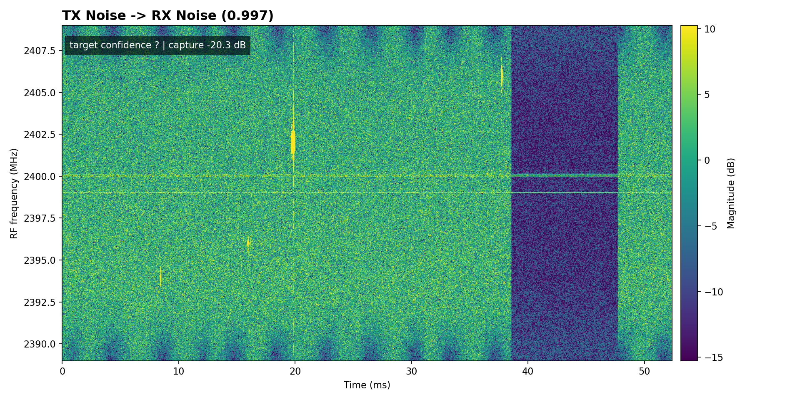

### Trial 47: Noise -> FutabaT14 (MISS)

Confidence `0.806`, target confidence `n/a`, capture power `-21.6 dB`, full-scale `0.00%`.

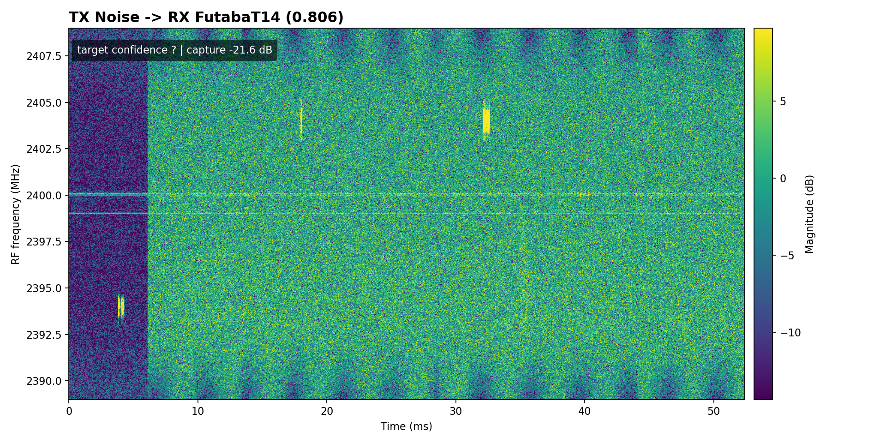

### Trial 50: Noise -> Noise (WIN)

Confidence `0.998`, target confidence `n/a`, capture power `-23.7 dB`, full-scale `0.29%`.

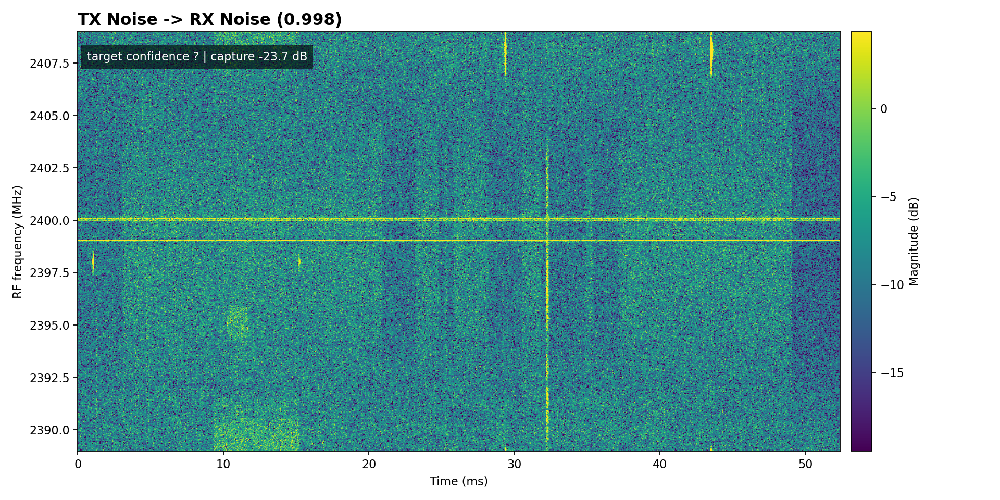

### Trial 51: Taranis -> Noise (MISS)

Confidence `0.996`, target confidence `0.005`, capture power `-26.1 dB`, full-scale `0.15%`.

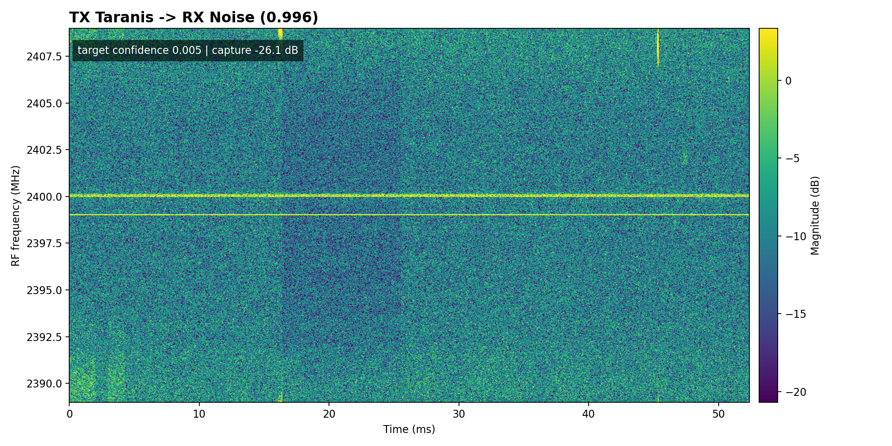

### Trial 52: Taranis -> Taranis (WIN)

Confidence `0.998`, target confidence `0.998`, capture power `-18.7 dB`, full-scale `0.17%`.


### Trial 59: Taranis -> Taranis (WIN)

Confidence `0.971`, target confidence `0.971`, capture power `-22.3 dB`, full-scale `0.00%`.

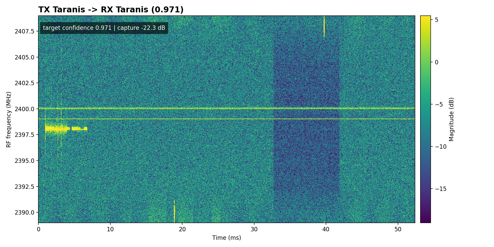

### Trial 61: Turnigy -> Turnigy (WIN)

Confidence `1.000`, target confidence `1.000`, capture power `-17.1 dB`, full-scale `0.75%`.

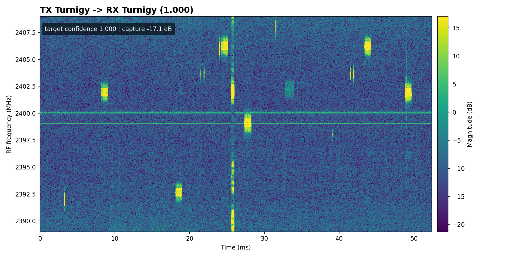

### Trial 66: Turnigy -> Turnigy (WIN)

Confidence `0.995`, target confidence `0.995`, capture power `-18.8 dB`, full-scale `0.00%`.

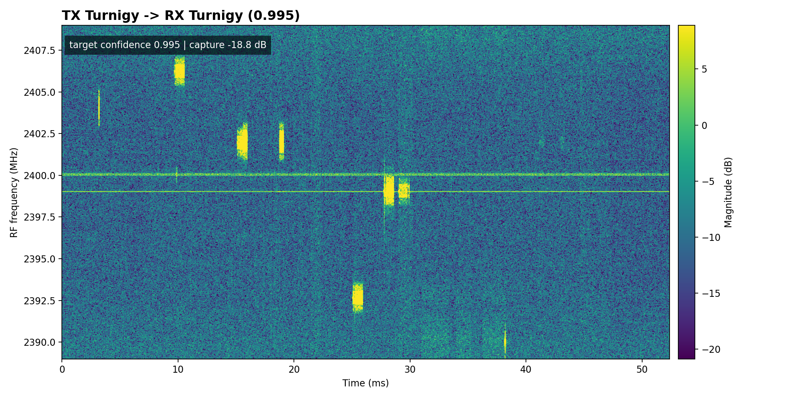

### Trial 70: Turnigy -> Turnigy (WIN)

Confidence `1.000`, target confidence `1.000`, capture power `-19.7 dB`, full-scale `0.00%`.

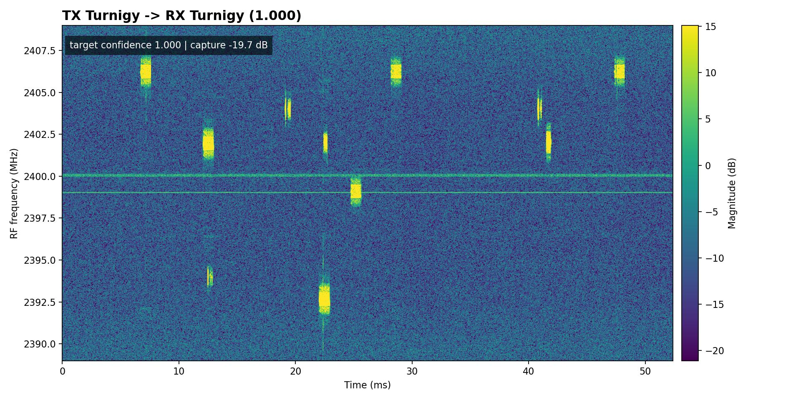

## Command

```bash
/home/jake/workspace/SDR/RF_Sentinel/.venv/bin/python3 scripts/live_noisy_drone_rf_classifier.py --tx-test-all-classes --tx-test-classes DJI,FutabaT14,FutabaT7,Graupner,Noise,Taranis,Turnigy --tx-test-count 10 --tx-min-snr 20 --tx-test-delay-sec 5 --tx-test-retries 3 --tx-test-output-csv outputs/noisy_drone_rf_v2_snr20_class_sweep.csv --tx-test-output-md results/noisy_drone_rf_v2/snr20_class_sweep_results.md --tx-test-save-rx-dir outputs/noisy_drone_rf_v2_snr20_iq --tx-test-save-plots-dir results/noisy_drone_rf_v2/snr20_waterfalls
```

## Per-Class Summary

| Class | Pass/Total | Accuracy | Min Target Confidence | Mean Target Confidence | Mean Capture Power dB | Max Full-Scale % |
|---|---:|---:|---:|---:|---:|---:|
| DJI | 10/10 | 1.000 | 0.998 | 1.000 | -24.4 | 0.120 |
| FutabaT14 | 10/10 | 1.000 | 1.000 | 1.000 | -17.3 | 1.000 |
| FutabaT7 | 10/10 | 1.000 | 0.766 | 0.972 | -19.2 | 0.750 |
| Graupner | 10/10 | 1.000 | 0.964 | 0.995 | -21.5 | 0.060 |
| Noise | 9/10 | 0.900 |  |  | -22.3 | 0.290 |
| Taranis | 9/10 | 0.900 | 0.005 | 0.895 | -21.3 | 0.170 |
| Turnigy | 10/10 | 1.000 | 0.995 | 0.999 | -19.2 | 0.750 |

## Per-Trial Results

| Trial | Target | Prediction | Confidence | Best Non-Noise | Target Confidence | Capture Power dB | Full-Scale % | TX Sample | RX IQ | Waterfall |
|---:|---|---|---:|---|---:|---:|---:|---|---|---|
| 1 | DJI | DJI | 1.000 | DJI | 1.000 | -20.4 | 0.12 | IQdata_sample709_target0_snr30.pt true=DJI target=0 snr=30dB | `outputs/noisy_drone_rf_v2_snr20_iq/001_DJI.npy` | `results/noisy_drone_rf_v2/snr20_waterfalls/001_DJI_waterfall.png` |
| 2 | DJI | DJI | 1.000 | DJI | 1.000 | -24.9 | 0.00 | IQdata_sample1122_target0_snr30.pt true=DJI target=0 snr=30dB | `outputs/noisy_drone_rf_v2_snr20_iq/002_DJI.npy` | `results/noisy_drone_rf_v2/snr20_waterfalls/002_DJI_waterfall.png` |
| 3 | DJI | DJI | 0.999 | DJI | 1.000 | -25.9 | 0.00 | IQdata_sample868_target0_snr24.pt true=DJI target=0 snr=24dB | `outputs/noisy_drone_rf_v2_snr20_iq/003_DJI.npy` | `results/noisy_drone_rf_v2/snr20_waterfalls/003_DJI_waterfall.png` |
| 4 | DJI | DJI | 1.000 | DJI | 1.000 | -22.8 | 0.00 | IQdata_sample824_target0_snr30.pt true=DJI target=0 snr=30dB | `outputs/noisy_drone_rf_v2_snr20_iq/004_DJI.npy` | `results/noisy_drone_rf_v2/snr20_waterfalls/004_DJI_waterfall.png` |
| 5 | DJI | DJI | 1.000 | DJI | 1.000 | -23.4 | 0.04 | IQdata_sample700_target0_snr26.pt true=DJI target=0 snr=26dB | `outputs/noisy_drone_rf_v2_snr20_iq/005_DJI.npy` | `results/noisy_drone_rf_v2/snr20_waterfalls/005_DJI_waterfall.png` |
| 6 | DJI | DJI | 0.999 | DJI | 1.000 | -25.3 | 0.00 | IQdata_sample800_target0_snr26.pt true=DJI target=0 snr=26dB | `outputs/noisy_drone_rf_v2_snr20_iq/006_DJI.npy` | `results/noisy_drone_rf_v2/snr20_waterfalls/006_DJI_waterfall.png` |
| 7 | DJI | DJI | 0.999 | DJI | 1.000 | -25.4 | 0.00 | IQdata_sample546_target0_snr24.pt true=DJI target=0 snr=24dB | `outputs/noisy_drone_rf_v2_snr20_iq/007_DJI.npy` | `results/noisy_drone_rf_v2/snr20_waterfalls/007_DJI_waterfall.png` |
| 8 | DJI | DJI | 0.996 | DJI | 0.998 | -26.8 | 0.00 | IQdata_sample1067_target0_snr30.pt true=DJI target=0 snr=30dB | `outputs/noisy_drone_rf_v2_snr20_iq/008_DJI.npy` | `results/noisy_drone_rf_v2/snr20_waterfalls/008_DJI_waterfall.png` |
| 9 | DJI | DJI | 0.998 | DJI | 0.999 | -23.0 | 0.01 | IQdata_sample868_target0_snr24.pt true=DJI target=0 snr=24dB | `outputs/noisy_drone_rf_v2_snr20_iq/009_DJI.npy` | `results/noisy_drone_rf_v2/snr20_waterfalls/009_DJI_waterfall.png` |
| 10 | DJI | DJI | 1.000 | DJI | 1.000 | -25.7 | 0.00 | IQdata_sample247_target0_snr20.pt true=DJI target=0 snr=20dB | `outputs/noisy_drone_rf_v2_snr20_iq/010_DJI.npy` | `results/noisy_drone_rf_v2/snr20_waterfalls/010_DJI_waterfall.png` |
| 11 | FutabaT14 | FutabaT14 | 1.000 | FutabaT14 | 1.000 | -17.9 | 0.75 | IQdata_sample3367_target1_snr22.pt true=FutabaT14 target=1 snr=22dB | `outputs/noisy_drone_rf_v2_snr20_iq/011_FutabaT14.npy` | `results/noisy_drone_rf_v2/snr20_waterfalls/011_FutabaT14_waterfall.png` |
| 12 | FutabaT14 | FutabaT14 | 1.000 | FutabaT14 | 1.000 | -17.1 | 0.75 | IQdata_sample3944_target1_snr20.pt true=FutabaT14 target=1 snr=20dB | `outputs/noisy_drone_rf_v2_snr20_iq/012_FutabaT14.npy` | `results/noisy_drone_rf_v2/snr20_waterfalls/012_FutabaT14_waterfall.png` |
| 13 | FutabaT14 | FutabaT14 | 1.000 | FutabaT14 | 1.000 | -17.7 | 0.75 | IQdata_sample4618_target1_snr20.pt true=FutabaT14 target=1 snr=20dB | `outputs/noisy_drone_rf_v2_snr20_iq/013_FutabaT14.npy` | `results/noisy_drone_rf_v2/snr20_waterfalls/013_FutabaT14_waterfall.png` |
| 14 | FutabaT14 | FutabaT14 | 1.000 | FutabaT14 | 1.000 | -17.2 | 0.75 | IQdata_sample1839_target1_snr26.pt true=FutabaT14 target=1 snr=26dB | `outputs/noisy_drone_rf_v2_snr20_iq/014_FutabaT14.npy` | `results/noisy_drone_rf_v2/snr20_waterfalls/014_FutabaT14_waterfall.png` |
| 15 | FutabaT14 | FutabaT14 | 1.000 | FutabaT14 | 1.000 | -17.3 | 0.75 | IQdata_sample3714_target1_snr20.pt true=FutabaT14 target=1 snr=20dB | `outputs/noisy_drone_rf_v2_snr20_iq/015_FutabaT14.npy` | `results/noisy_drone_rf_v2/snr20_waterfalls/015_FutabaT14_waterfall.png` |
| 16 | FutabaT14 | FutabaT14 | 1.000 | FutabaT14 | 1.000 | -18.1 | 0.75 | IQdata_sample3372_target1_snr26.pt true=FutabaT14 target=1 snr=26dB | `outputs/noisy_drone_rf_v2_snr20_iq/016_FutabaT14.npy` | `results/noisy_drone_rf_v2/snr20_waterfalls/016_FutabaT14_waterfall.png` |
| 17 | FutabaT14 | FutabaT14 | 1.000 | FutabaT14 | 1.000 | -17.0 | 0.75 | IQdata_sample3818_target1_snr20.pt true=FutabaT14 target=1 snr=20dB | `outputs/noisy_drone_rf_v2_snr20_iq/017_FutabaT14.npy` | `results/noisy_drone_rf_v2/snr20_waterfalls/017_FutabaT14_waterfall.png` |
| 18 | FutabaT14 | FutabaT14 | 1.000 | FutabaT14 | 1.000 | -16.9 | 0.75 | IQdata_sample2229_target1_snr28.pt true=FutabaT14 target=1 snr=28dB | `outputs/noisy_drone_rf_v2_snr20_iq/018_FutabaT14.npy` | `results/noisy_drone_rf_v2/snr20_waterfalls/018_FutabaT14_waterfall.png` |
| 19 | FutabaT14 | FutabaT14 | 1.000 | FutabaT14 | 1.000 | -16.6 | 1.00 | IQdata_sample2004_target1_snr22.pt true=FutabaT14 target=1 snr=22dB | `outputs/noisy_drone_rf_v2_snr20_iq/019_FutabaT14.npy` | `results/noisy_drone_rf_v2/snr20_waterfalls/019_FutabaT14_waterfall.png` |
| 20 | FutabaT14 | FutabaT14 | 1.000 | FutabaT14 | 1.000 | -17.1 | 0.75 | IQdata_sample2575_target1_snr20.pt true=FutabaT14 target=1 snr=20dB | `outputs/noisy_drone_rf_v2_snr20_iq/020_FutabaT14.npy` | `results/noisy_drone_rf_v2/snr20_waterfalls/020_FutabaT14_waterfall.png` |
| 21 | FutabaT7 | FutabaT7 | 1.000 | FutabaT7 | 1.000 | -17.9 | 0.75 | IQdata_sample5426_target2_snr20.pt true=FutabaT7 target=2 snr=20dB | `outputs/noisy_drone_rf_v2_snr20_iq/021_FutabaT7.npy` | `results/noisy_drone_rf_v2/snr20_waterfalls/021_FutabaT7_waterfall.png` |
| 22 | FutabaT7 | FutabaT7 | 1.000 | FutabaT7 | 1.000 | -17.0 | 0.75 | IQdata_sample5085_target2_snr20.pt true=FutabaT7 target=2 snr=20dB | `outputs/noisy_drone_rf_v2_snr20_iq/022_FutabaT7.npy` | `results/noisy_drone_rf_v2/snr20_waterfalls/022_FutabaT7_waterfall.png` |
| 23 | FutabaT7 | FutabaT7 | 0.998 | FutabaT7 | 0.998 | -17.3 | 0.75 | IQdata_sample4963_target2_snr22.pt true=FutabaT7 target=2 snr=22dB | `outputs/noisy_drone_rf_v2_snr20_iq/023_FutabaT7.npy` | `results/noisy_drone_rf_v2/snr20_waterfalls/023_FutabaT7_waterfall.png` |
| 24 | FutabaT7 | FutabaT7 | 0.761 | FutabaT7 | 0.766 | -18.0 | 0.75 | IQdata_sample5360_target2_snr24.pt true=FutabaT7 target=2 snr=24dB | `outputs/noisy_drone_rf_v2_snr20_iq/024_FutabaT7.npy` | `results/noisy_drone_rf_v2/snr20_waterfalls/024_FutabaT7_waterfall.png` |
| 25 | FutabaT7 | FutabaT7 | 0.999 | FutabaT7 | 0.999 | -18.0 | 0.75 | IQdata_sample5309_target2_snr20.pt true=FutabaT7 target=2 snr=20dB | `outputs/noisy_drone_rf_v2_snr20_iq/025_FutabaT7.npy` | `results/noisy_drone_rf_v2/snr20_waterfalls/025_FutabaT7_waterfall.png` |
| 26 | FutabaT7 | FutabaT7 | 1.000 | FutabaT7 | 1.000 | -17.6 | 0.75 | IQdata_sample5510_target2_snr30.pt true=FutabaT7 target=2 snr=30dB | `outputs/noisy_drone_rf_v2_snr20_iq/026_FutabaT7.npy` | `results/noisy_drone_rf_v2/snr20_waterfalls/026_FutabaT7_waterfall.png` |
| 27 | FutabaT7 | FutabaT7 | 0.998 | FutabaT7 | 0.998 | -20.1 | 0.00 | IQdata_sample5485_target2_snr22.pt true=FutabaT7 target=2 snr=22dB | `outputs/noisy_drone_rf_v2_snr20_iq/027_FutabaT7.npy` | `results/noisy_drone_rf_v2/snr20_waterfalls/027_FutabaT7_waterfall.png` |
| 28 | FutabaT7 | FutabaT7 | 1.000 | FutabaT7 | 1.000 | -16.9 | 0.75 | IQdata_sample5459_target2_snr28.pt true=FutabaT7 target=2 snr=28dB | `outputs/noisy_drone_rf_v2_snr20_iq/028_FutabaT7.npy` | `results/noisy_drone_rf_v2/snr20_waterfalls/028_FutabaT7_waterfall.png` |
| 29 | FutabaT7 | FutabaT7 | 0.953 | FutabaT7 | 0.956 | -26.5 | 0.00 | IQdata_sample5050_target2_snr24.pt true=FutabaT7 target=2 snr=24dB | `outputs/noisy_drone_rf_v2_snr20_iq/029_FutabaT7.npy` | `results/noisy_drone_rf_v2/snr20_waterfalls/029_FutabaT7_waterfall.png` |
| 30 | FutabaT7 | FutabaT7 | 1.000 | FutabaT7 | 1.000 | -23.2 | 0.00 | IQdata_sample5285_target2_snr24.pt true=FutabaT7 target=2 snr=24dB | `outputs/noisy_drone_rf_v2_snr20_iq/030_FutabaT7.npy` | `results/noisy_drone_rf_v2/snr20_waterfalls/030_FutabaT7_waterfall.png` |
| 31 | Graupner | Graupner | 0.878 | Graupner | 0.964 | -20.6 | 0.00 | IQdata_sample6065_target3_snr30.pt true=Graupner target=3 snr=30dB | `outputs/noisy_drone_rf_v2_snr20_iq/031_Graupner.npy` | `results/noisy_drone_rf_v2/snr20_waterfalls/031_Graupner_waterfall.png` |
| 32 | Graupner | Graupner | 1.000 | Graupner | 1.000 | -21.2 | 0.06 | IQdata_sample6086_target3_snr30.pt true=Graupner target=3 snr=30dB | `outputs/noisy_drone_rf_v2_snr20_iq/032_Graupner.npy` | `results/noisy_drone_rf_v2/snr20_waterfalls/032_Graupner_waterfall.png` |
| 33 | Graupner | Graupner | 0.992 | Graupner | 0.997 | -23.2 | 0.00 | IQdata_sample6308_target3_snr22.pt true=Graupner target=3 snr=22dB | `outputs/noisy_drone_rf_v2_snr20_iq/033_Graupner.npy` | `results/noisy_drone_rf_v2/snr20_waterfalls/033_Graupner_waterfall.png` |
| 34 | Graupner | Graupner | 1.000 | Graupner | 1.000 | -21.7 | 0.00 | IQdata_sample6353_target3_snr20.pt true=Graupner target=3 snr=20dB | `outputs/noisy_drone_rf_v2_snr20_iq/034_Graupner.npy` | `results/noisy_drone_rf_v2/snr20_waterfalls/034_Graupner_waterfall.png` |
| 35 | Graupner | Graupner | 1.000 | Graupner | 1.000 | -21.3 | 0.00 | IQdata_sample6160_target3_snr30.pt true=Graupner target=3 snr=30dB | `outputs/noisy_drone_rf_v2_snr20_iq/035_Graupner.npy` | `results/noisy_drone_rf_v2/snr20_waterfalls/035_Graupner_waterfall.png` |
| 36 | Graupner | Graupner | 1.000 | Graupner | 1.000 | -20.8 | 0.00 | IQdata_sample5853_target3_snr22.pt true=Graupner target=3 snr=22dB | `outputs/noisy_drone_rf_v2_snr20_iq/036_Graupner.npy` | `results/noisy_drone_rf_v2/snr20_waterfalls/036_Graupner_waterfall.png` |
| 37 | Graupner | Graupner | 0.992 | Graupner | 0.994 | -20.2 | 0.00 | IQdata_sample6183_target3_snr26.pt true=Graupner target=3 snr=26dB | `outputs/noisy_drone_rf_v2_snr20_iq/037_Graupner.npy` | `results/noisy_drone_rf_v2/snr20_waterfalls/037_Graupner_waterfall.png` |
| 38 | Graupner | Graupner | 0.982 | Graupner | 0.994 | -22.1 | 0.00 | IQdata_sample5792_target3_snr24.pt true=Graupner target=3 snr=24dB | `outputs/noisy_drone_rf_v2_snr20_iq/038_Graupner.npy` | `results/noisy_drone_rf_v2/snr20_waterfalls/038_Graupner_waterfall.png` |
| 39 | Graupner | Graupner | 0.999 | Graupner | 0.999 | -19.5 | 0.03 | IQdata_sample6202_target3_snr20.pt true=Graupner target=3 snr=20dB | `outputs/noisy_drone_rf_v2_snr20_iq/039_Graupner.npy` | `results/noisy_drone_rf_v2/snr20_waterfalls/039_Graupner_waterfall.png` |
| 40 | Graupner | Graupner | 0.994 | Graupner | 0.997 | -24.0 | 0.01 | IQdata_sample6115_target3_snr22.pt true=Graupner target=3 snr=22dB | `outputs/noisy_drone_rf_v2_snr20_iq/040_Graupner.npy` | `results/noisy_drone_rf_v2/snr20_waterfalls/040_Graupner_waterfall.png` |
| 41 | Noise | Noise | 0.997 | FutabaT14 |  | -20.3 | 0.01 | IQdata_sample12064_target4_snr20.pt true=Noise target=4 snr=20dB | `outputs/noisy_drone_rf_v2_snr20_iq/041_Noise.npy` | `results/noisy_drone_rf_v2/snr20_waterfalls/041_Noise_waterfall.png` |
| 42 | Noise | Noise | 0.998 | DJI |  | -25.0 | 0.00 | IQdata_sample15094_target4_snr22.pt true=Noise target=4 snr=22dB | `outputs/noisy_drone_rf_v2_snr20_iq/042_Noise.npy` | `results/noisy_drone_rf_v2/snr20_waterfalls/042_Noise_waterfall.png` |
| 43 | Noise | Noise | 0.998 | FutabaT14 |  | -23.5 | 0.00 | IQdata_sample15649_target4_snr20.pt true=Noise target=4 snr=20dB | `outputs/noisy_drone_rf_v2_snr20_iq/043_Noise.npy` | `results/noisy_drone_rf_v2/snr20_waterfalls/043_Noise_waterfall.png` |
| 44 | Noise | Noise | 0.998 | DJI |  | -19.5 | 0.04 | IQdata_sample11432_target4_snr20.pt true=Noise target=4 snr=20dB | `outputs/noisy_drone_rf_v2_snr20_iq/044_Noise.npy` | `results/noisy_drone_rf_v2/snr20_waterfalls/044_Noise_waterfall.png` |
| 45 | Noise | Noise | 0.998 | DJI |  | -22.5 | 0.09 | IQdata_sample12928_target4_snr24.pt true=Noise target=4 snr=24dB | `outputs/noisy_drone_rf_v2_snr20_iq/045_Noise.npy` | `results/noisy_drone_rf_v2/snr20_waterfalls/045_Noise_waterfall.png` |
| 46 | Noise | Noise | 0.998 | DJI |  | -23.0 | 0.00 | IQdata_sample11890_target4_snr20.pt true=Noise target=4 snr=20dB | `outputs/noisy_drone_rf_v2_snr20_iq/046_Noise.npy` | `results/noisy_drone_rf_v2/snr20_waterfalls/046_Noise_waterfall.png` |
| 47 | Noise | FutabaT14 | 0.806 | FutabaT14 |  | -21.6 | 0.00 | IQdata_sample11510_target4_snr28.pt true=Noise target=4 snr=28dB | `outputs/noisy_drone_rf_v2_snr20_iq/047_Noise.npy` | `results/noisy_drone_rf_v2/snr20_waterfalls/047_Noise_waterfall.png` |
| 48 | Noise | Noise | 0.998 | DJI |  | -23.5 | 0.00 | IQdata_sample11115_target4_snr20.pt true=Noise target=4 snr=20dB | `outputs/noisy_drone_rf_v2_snr20_iq/048_Noise.npy` | `results/noisy_drone_rf_v2/snr20_waterfalls/048_Noise_waterfall.png` |
| 49 | Noise | Noise | 0.995 | DJI |  | -20.3 | 0.00 | IQdata_sample10098_target4_snr24.pt true=Noise target=4 snr=24dB | `outputs/noisy_drone_rf_v2_snr20_iq/049_Noise.npy` | `results/noisy_drone_rf_v2/snr20_waterfalls/049_Noise_waterfall.png` |
| 50 | Noise | Noise | 0.998 | DJI |  | -23.7 | 0.29 | IQdata_sample9886_target4_snr30.pt true=Noise target=4 snr=30dB | `outputs/noisy_drone_rf_v2_snr20_iq/050_Noise.npy` | `results/noisy_drone_rf_v2/snr20_waterfalls/050_Noise_waterfall.png` |
| 51 | Taranis | Noise | 0.996 | DJI | 0.005 | -26.1 | 0.15 | IQdata_sample6773_target5_snr26.pt true=Taranis target=5 snr=26dB | `outputs/noisy_drone_rf_v2_snr20_iq/051_Taranis.npy` | `results/noisy_drone_rf_v2/snr20_waterfalls/051_Taranis_waterfall.png` |
| 52 | Taranis | Taranis | 0.998 | Taranis | 0.998 | -18.7 | 0.17 | IQdata_sample7097_target5_snr20.pt true=Taranis target=5 snr=20dB | `outputs/noisy_drone_rf_v2_snr20_iq/052_Taranis.npy` | `results/noisy_drone_rf_v2/snr20_waterfalls/052_Taranis_waterfall.png` |
| 53 | Taranis | Taranis | 1.000 | Taranis | 1.000 | -20.8 | 0.00 | IQdata_sample8002_target5_snr24.pt true=Taranis target=5 snr=24dB | `outputs/noisy_drone_rf_v2_snr20_iq/053_Taranis.npy` | `results/noisy_drone_rf_v2/snr20_waterfalls/053_Taranis_waterfall.png` |
| 54 | Taranis | Taranis | 0.994 | Taranis | 0.994 | -22.0 | 0.12 | IQdata_sample7025_target5_snr30.pt true=Taranis target=5 snr=30dB | `outputs/noisy_drone_rf_v2_snr20_iq/054_Taranis.npy` | `results/noisy_drone_rf_v2/snr20_waterfalls/054_Taranis_waterfall.png` |
| 55 | Taranis | Taranis | 0.999 | Taranis | 0.999 | -19.4 | 0.00 | IQdata_sample7470_target5_snr20.pt true=Taranis target=5 snr=20dB | `outputs/noisy_drone_rf_v2_snr20_iq/055_Taranis.npy` | `results/noisy_drone_rf_v2/snr20_waterfalls/055_Taranis_waterfall.png` |
| 56 | Taranis | Taranis | 1.000 | Taranis | 1.000 | -19.7 | 0.00 | IQdata_sample6853_target5_snr22.pt true=Taranis target=5 snr=22dB | `outputs/noisy_drone_rf_v2_snr20_iq/056_Taranis.npy` | `results/noisy_drone_rf_v2/snr20_waterfalls/056_Taranis_waterfall.png` |
| 57 | Taranis | Taranis | 1.000 | Taranis | 1.000 | -21.3 | 0.00 | IQdata_sample6444_target5_snr24.pt true=Taranis target=5 snr=24dB | `outputs/noisy_drone_rf_v2_snr20_iq/057_Taranis.npy` | `results/noisy_drone_rf_v2/snr20_waterfalls/057_Taranis_waterfall.png` |
| 58 | Taranis | Taranis | 0.997 | Taranis | 0.997 | -22.9 | 0.00 | IQdata_sample7184_target5_snr20.pt true=Taranis target=5 snr=20dB | `outputs/noisy_drone_rf_v2_snr20_iq/058_Taranis.npy` | `results/noisy_drone_rf_v2/snr20_waterfalls/058_Taranis_waterfall.png` |
| 59 | Taranis | Taranis | 0.971 | Taranis | 0.971 | -22.3 | 0.00 | IQdata_sample6903_target5_snr20.pt true=Taranis target=5 snr=20dB | `outputs/noisy_drone_rf_v2_snr20_iq/059_Taranis.npy` | `results/noisy_drone_rf_v2/snr20_waterfalls/059_Taranis_waterfall.png` |
| 60 | Taranis | Taranis | 0.990 | Taranis | 0.990 | -20.1 | 0.00 | IQdata_sample7626_target5_snr20.pt true=Taranis target=5 snr=20dB | `outputs/noisy_drone_rf_v2_snr20_iq/060_Taranis.npy` | `results/noisy_drone_rf_v2/snr20_waterfalls/060_Taranis_waterfall.png` |
| 61 | Turnigy | Turnigy | 1.000 | Turnigy | 1.000 | -17.1 | 0.75 | IQdata_sample8372_target6_snr26.pt true=Turnigy target=6 snr=26dB | `outputs/noisy_drone_rf_v2_snr20_iq/061_Turnigy.npy` | `results/noisy_drone_rf_v2/snr20_waterfalls/061_Turnigy_waterfall.png` |
| 62 | Turnigy | Turnigy | 1.000 | Turnigy | 1.000 | -21.3 | 0.00 | IQdata_sample8145_target6_snr26.pt true=Turnigy target=6 snr=26dB | `outputs/noisy_drone_rf_v2_snr20_iq/062_Turnigy.npy` | `results/noisy_drone_rf_v2/snr20_waterfalls/062_Turnigy_waterfall.png` |
| 63 | Turnigy | Turnigy | 1.000 | Turnigy | 1.000 | -21.0 | 0.00 | IQdata_sample8609_target6_snr26.pt true=Turnigy target=6 snr=26dB | `outputs/noisy_drone_rf_v2_snr20_iq/063_Turnigy.npy` | `results/noisy_drone_rf_v2/snr20_waterfalls/063_Turnigy_waterfall.png` |
| 64 | Turnigy | Turnigy | 0.999 | Turnigy | 0.999 | -17.1 | 0.75 | IQdata_sample8728_target6_snr22.pt true=Turnigy target=6 snr=22dB | `outputs/noisy_drone_rf_v2_snr20_iq/064_Turnigy.npy` | `results/noisy_drone_rf_v2/snr20_waterfalls/064_Turnigy_waterfall.png` |
| 65 | Turnigy | Turnigy | 1.000 | Turnigy | 1.000 | -20.4 | 0.00 | IQdata_sample8168_target6_snr28.pt true=Turnigy target=6 snr=28dB | `outputs/noisy_drone_rf_v2_snr20_iq/065_Turnigy.npy` | `results/noisy_drone_rf_v2/snr20_waterfalls/065_Turnigy_waterfall.png` |
| 66 | Turnigy | Turnigy | 0.995 | Turnigy | 0.995 | -18.8 | 0.00 | IQdata_sample8472_target6_snr26.pt true=Turnigy target=6 snr=26dB | `outputs/noisy_drone_rf_v2_snr20_iq/066_Turnigy.npy` | `results/noisy_drone_rf_v2/snr20_waterfalls/066_Turnigy_waterfall.png` |
| 67 | Turnigy | Turnigy | 0.996 | Turnigy | 0.996 | -20.2 | 0.00 | IQdata_sample8421_target6_snr22.pt true=Turnigy target=6 snr=22dB | `outputs/noisy_drone_rf_v2_snr20_iq/067_Turnigy.npy` | `results/noisy_drone_rf_v2/snr20_waterfalls/067_Turnigy_waterfall.png` |
| 68 | Turnigy | Turnigy | 1.000 | Turnigy | 1.000 | -19.3 | 0.00 | IQdata_sample8661_target6_snr24.pt true=Turnigy target=6 snr=24dB | `outputs/noisy_drone_rf_v2_snr20_iq/068_Turnigy.npy` | `results/noisy_drone_rf_v2/snr20_waterfalls/068_Turnigy_waterfall.png` |
| 69 | Turnigy | Turnigy | 0.996 | Turnigy | 0.996 | -17.6 | 0.75 | IQdata_sample8842_target6_snr26.pt true=Turnigy target=6 snr=26dB | `outputs/noisy_drone_rf_v2_snr20_iq/069_Turnigy.npy` | `results/noisy_drone_rf_v2/snr20_waterfalls/069_Turnigy_waterfall.png` |
| 70 | Turnigy | Turnigy | 1.000 | Turnigy | 1.000 | -19.7 | 0.00 | IQdata_sample8366_target6_snr30.pt true=Turnigy target=6 snr=30dB | `outputs/noisy_drone_rf_v2_snr20_iq/070_Turnigy.npy` | `results/noisy_drone_rf_v2/snr20_waterfalls/070_Turnigy_waterfall.png` |

## Notes

- `prediction` is the final script decision after the configured decision policy.
- `best_non_noise` and `target confidence` are conditional on the non-noise class mass.
- Full-scale percentages above zero indicate some clipping or saturation in the saved RX window.
